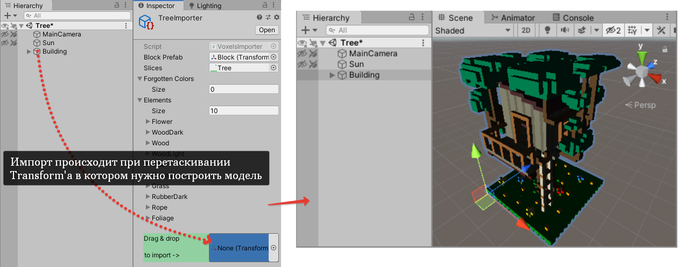

# Тестовое задание по проекту Wazzapps TapTower

## Предыстория
Разработчик должен был реализовать систему для импорта воксельных моделей из программы MagicaVoxel в Unity. Он успел реализовать самую сложную алгоритмическую часть и запушить ее в репозиторий, но на следующий день его увезли на скорой с симптомами коронавируса, поэтому закончить задачу предстоит вам.

## Подробности
- Для того чтобы не разбираться со спецификацией формата **.vox** было решено импортировать модели, представленные в виде изображения, содержащего горизонтальные срезы 3D-объекта.
- В коде есть пометка, чего не хватает для завершения задачи.
- Импорт модели выполняется через специальный ассет:

## Выполнение
1. Создайте свой репозиторий с дубликатом проекта и отдельным коммитом (или несколькими) внесите необходимые изменения.
2. Предложите любые изменения (без реализации, только предложение), которые могли бы сделать алгоритм импорта лучше.
